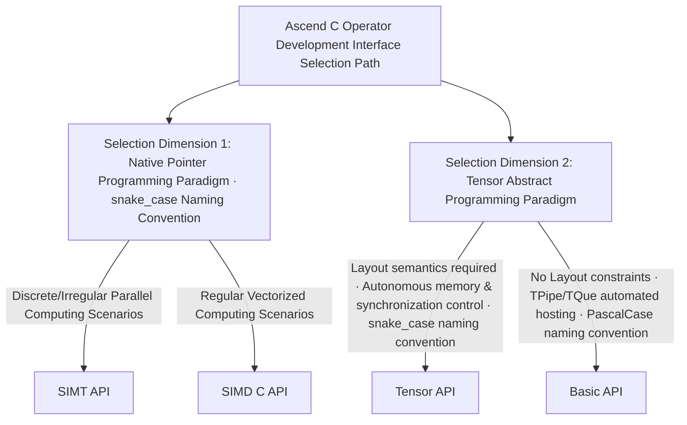

# Ascend C Multi-Level Programming Interface Selection Guide

Welcome to use [Ascend C](https://asc.gitcode.com) for operator development on Ascend AI processors. Ascend C not only **unlocks the full programmability of the chip to deliver ultimate performance**, but also adopts a multi-layered programming API design, allowing you to flexibly select the most suitable API based on project requirements, team expertise and performance goals, to achieve an optimal balance between development efficiency and runtime performance.

---

## Design Goals

Ascend C takes **"C/C++ Standard Compatibility · Ultimate Computing Power Unleashed"** as its core design philosophy: it implements minimal syntax extensions on the basis of strict compliance with C/C++ language specifications, enabling developers with C/C++ fundamentals to migrate smoothly to the Ascend platform with a low threshold, and independently unleash the full computing potential of the chip. The language is simultaneously compatible with the pointer-based native C development paradigm and the modern Tensor+Layout C++ programming mode. While deeply supporting operator customization and optimization, it realizes seamless integration with existing C/C++ development ecosystems and ensures consistent cross-platform development experience.

We adhere to two core design principles:
- **No Silver Bullet**: Different business scenarios have varying demands for performance and development efficiency. There is no single optimal interface suitable for all scenarios, and layered design is the core approach to balance efficiency and performance.
- **Progressive Growth**: Entry-level developers can quickly get started with high-level easy-to-use interfaces to complete algorithm verification and prototype implementation; senior developers can dive into low-level interfaces to fully unleash hardware potential through fine-grained tuning.

## API Layers

Following the core principle of "standard C/C++ syntax, minimal syntax extensions", Ascend C builds a lightweight and high-performance underlying foundation for operator programming, providing programming interfaces with different abstraction levels in layers.

| API Layer | Language Paradigm | Core Features | Target Users | Core Value |
|-----------|-------------------|---------------|--------------|------------|
| **Basic API** | C++ | Built on the SIMD programming model, adopts Tensor abstraction without Layout constraints; implements unified management of memory scheduling and execution synchronization via the TPipe/TQue framework | General operator library developers | Automatically handles memory and synchronization management through the framework, shields underlying hardware implementation details, effectively reduces development complexity, and improves programming usability and engineering delivery efficiency |
| **Tensor API** | C++ | Built on the SIMD programming model, provides Tensor abstraction with **Layout** semantics via the Layout algebra system; adopts a three-layer decoupled API architecture of **arch/atom/algorithm** | High-performance operator optimization developers | Treats tensors and layouts as first-class citizens. Built-in Layout algebra enables zero-cost compilation abstraction; three-layer decoupling achieves separation of concerns, with native cross-architecture portability |
| **SIMD C API** | C | Built on the SIMD programming model and **native pointer** paradigm, provides complete C-level underlying programmability; supports array subscript memory access, with memory lifecycle and execution synchronization fully controlled by developers | Ultimate performance tuning developers | Fully conforms to native C development habits, supports in-depth customization of memory layout and synchronization strategies; instruction-level transparent mapping delivers zero encapsulation overhead, fully opens underlying hardware capabilities, and enables fine-grained performance tuning and maximum hardware utilization |
| **SIMT API** | C | Built on the industry-standard SIMT programming model, takes single thread as the basic programming unit, and natively supports discrete and irregular parallel computing logic | Developers of high-performance operators for irregular scenarios | Naturally adapts to discrete and irregular parallel computing scenarios, aligns with mainstream heterogeneous development paradigms in the industry, and effectively reduces cross-technology migration cost and learning threshold |

On top of the underlying programming interface system, Ascend C further provides operator template libraries and high-level API components. By precipitating general development capabilities and engineering best practices, it continuously lowers the threshold for operator development and accelerates algorithm prototype verification and business implementation.

| Component Layer | Target Users | Core Value |
|-----------------|--------------|------------|
| **Operator Template Libraries (ATVC/ATVOSS/BLAZE, etc.)** | Algorithm developers | Provide high-performance template implementations of typical operators covering Vector, Cube and other computing paradigms, support template-based customized expansion, quickly adapt to high-performance computing requirements of business scenarios, and precipitate end-to-end performance optimization best practices |
| **High-Level API** | Algorithm developers | Encapsulate general single-core computing algorithm primitives such as Softmax and Matmul, shield underlying hardware implementation details, enable developers to quickly build algorithm logic, efficiently complete function verification and scheme prototyping, and shorten the cycle from idea to runnable operator |

In addition, the joint ecosystem is continuously building foundational components such as **asc-stl** (C++ standard library for kernel programming) and **asc-mathdx**(on-device linear algebra library) to continuously enrich the Ascend C operator programming ecosystem.

---

## How to Quickly Select the Appropriate API Layer?

Ascend C has built a layered interface system covering different programming paradigms. Developers can complete interface selection along the following path based on their own development habits and business scenario characteristics:

---

You can also make quick decisions based on the following key dimensions combined with core business demands:

| Selection Dimension | Recommended API Layer | Selection Rationale |
|---------------------|-----------------------|---------------------|
| **Discrete/Irregular Vector Computing Scenarios** | SIMT API | Fully unleashes the hardware acceleration advantages of the SIMT architecture for discrete and irregular parallel tasks, while being compatible with the industry-standard SIMT programming paradigm, reducing developers' migration and learning costs |
| **Ultimate Performance Tuning (Pointer Development Habit)** | SIMD C API | Supports the standard C pointer development paradigm, enables full-stack independent control of memory layout and synchronization logic, and can maximize the mining of chip hardware computing power to achieve ultimate performance |
| **C++ Tensor Paradigm Operator Development** | Tensor API | Natively supports Tensor abstraction with Layout semantics, simplifies memory layout management and index calculation through Layout algebra capability, and balances development convenience and in-depth performance tuning space |
| **Rapid Algorithm Prototype Verification** | High-Level API / Operator Template Libraries | Built with high-performance generalized implementations of general single-core algorithms and typical operators, shields underlying hardware implementation details, greatly shortens the development cycle, and improves algorithm iteration and implementation efficiency |

---

## Detailed Introduction to Each Layer

### Language Extension Layer SIMT API

**Core Definition**
As a multi-threaded parallel programming interface in the Ascend C language extension layer, it is natively compatible with the industry-standard SIMT programming model, ensures consistent cross-technology development experience, and enables high-performance operator development in discrete and irregular computing scenarios.

**Core Features**
- **Standard SIMT Programming Model Compatibility**: Supports industry-common programming models and interfaces. Engineers with SIMT technology stack development experience can quickly adapt, effectively reducing migration and learning costs, and enabling smooth reuse of existing development experience and engineering assets.

**Applicable Scenarios**
- Developers with SIMT heterogeneous development background who need to migrate to the Ascend AI processor platform with low cost and high efficiency;
- Operator development and rapid algorithm prototype verification for irregular computing scenarios such as discrete addressing and irregular parallelism.

**Reference Examples**
- [SIMT Gather Operator Example (Standard Programming Paradigm)](../../examples/03_simt_api/00_introduction/01_gather/basic_gather/gather_1d/gather_1d.asc)
- For more examples, please refer to the [examples directory](../../examples)

---

### Language Extension Layer SIMD C API

**Core Definition**
As a vectorized programming interface in the Ascend C language extension layer, it fully follows the standard C language development paradigm and provides instruction-level transparent underlying programmability; supports full-stack independent control of memory layout and execution synchronization, unleashes hardware computing power with zero encapsulation overhead, and enables fine-grained performance tuning and ultimate performance achievement.

**Core Features**
- **Native C Language Paradigm Compatibility**: Supports the standard C language operator development mode, natively supports array-style memory allocation and pointer-based computing primitives; all interfaces uniformly adopt the snake_case naming convention with the `asc_xxx` prefix, featuring clear semantics and high recognizability, which reduces developers' understanding and access costs.
- **Systematic SIMD Vectorized Interfaces**: Provides a full-scenario matrix of continuous vector computing interfaces to meet the development needs of most conventional operators. Take the basic vector addition interface as an example: `asc_add(__ubuf__ half* dst, __ubuf__ half* src0, __ubuf__ half* src1, uint32_t count)`, with intuitive interface definition and concise calling logic.
- **Hierarchical Synchronization Mechanism Design**: Balances development efficiency and performance controllability by providing layered synchronization capabilities. For rapid development and function verification scenarios, it has a built-in simplified synchronization management mechanism, and is equipped with integrated computing interfaces with the `_sync` suffix (e.g., `asc_add_sync(...)`). Developers can quickly complete function implementation without explicitly managing synchronization timing.
- **Advanced Data Layout Control Capability**: For ultimate performance tuning scenarios, it provides advanced computing interfaces with control parameters such as `repeat`/`stride`, supports flexible configuration of data access stride, repeated calculation modes and memory layout strategies, enabling developers to deeply customize computing logic and fully tap the upper limit of hardware computing power.

**Applicable Scenarios**
- Low-level operator R&D personnel with solid C language development foundation and preference for native pointer programming paradigm;
- Production-grade high-performance operator development scenarios that require in-depth mining of hardware computing power and ultimate performance tuning.

**Reference Examples**
- [SIMD Add Operator Example (Synchronized Integrated Computing Interface)](../../examples/02_simd_c_api/00_introduction/01_add/c_api_sync_add/c_api_add.asc)
- For more examples, please refer to the [examples directory](../../examples)

---

### Tensor API: C++ Low-Level Programming Interface with Layout Semantics (Full Autonomous Resource Control)

**Core Definition**
C++-level low-level programming interface for in-depth development of high-performance operators. It takes Tensor with Layout semantics as the core programming abstraction and provides complete underlying hardware programmability. It supports developers to fully control memory allocation and execution synchronization autonomously, and realizes in-depth release of hardware computing power while supporting the industry-standard Tensor programming paradigm.

**Core Features**
- **Standardized Tensor Abstraction**: Encapsulates NPU hardware instructions based on Tensor objects and data type systems, supports the industry-standard Tensor programming model, and ensures consistent cross-platform development experience.
- **Full Autonomous Resource Control**: Provides native memory allocation interfaces and synchronization primitives independent of the TPipe/TQue framework, supporting developers to independently control memory lifecycle and execution timing based on Tensor objects, to meet the customized requirements of in-depth performance tuning.
- **Layout as First-Class Citizen Design**: Incorporates data layout (Layout) into the native attribute system of Tensor. Through unified layout abstraction and algebraic operation capabilities, it automatically simplifies memory index derivation and layout transformation logic, significantly reduces development complexity in complex data layout scenarios, and improves code maintainability.
- **Zero-Cost Compilation Abstraction**: All layers from arch to algorithm are lightweight compilation encapsulations; no virtual functions, no dynamic memory allocation, and the runtime performance is completely equivalent to handwritten C code.
- **Three-Layer Decoupling with Separation of Concerns**: Hardware instructions (arch), atomic layer (atom), and algorithm layer (algorithm) evolve independently; for new architectures, only changes in the arch layer are required, and code in the atom and algorithm layers barely needs modification.
- **Highly Composable Lego-Style Design**: Any atom can adapt to any algorithm, and any layout can be combined with any atom; kernels are built through modular building-block splicing, which greatly reduces kernel development costs.
- **Native Architecture Portability**: User code is programmed against algorithm/atom interfaces, and hardware differences are shielded by arch layer specialization; it well supports cross-architecture and cross-chip code migration and reuse.

**Applicable Scenarios**
- Operator developers with industry C++ Tensor development experience who want to migrate to the Ascend platform with a low threshold;
- Production-grade high-performance operator development scenarios that require guaranteed code standardization, maintainability and scalability while pursuing ultimate hardware performance.

**Reference Examples**
- [Matmul Example Based on Tensor API](../../examples/01_simd_cpp_api/03_basic_api/03_matrix_compute/mmad_tensor_api/mmad_tensor_api.asc)

---

### Basic API: Lightweight Tensor Programming Interface (TPipe/TQue Automated Resource Management)

**Core Definition**
A lightweight C++ programming interface for efficient development, built on Tensor abstraction without Layout constraints. It relies on the TPipe/TQue framework to implement fully automated management of memory scheduling and execution synchronization, shielding underlying hardware details, greatly lowering the threshold for operator development, and improving engineering delivery efficiency.

**Core Features**
- **Lightweight Instruction Encapsulation**: Abstracts basic NPU computing instructions based on Tensor and data types, provides easy-to-use Tensor programming interfaces with low learning cost and quick development start.
- **Framework-Level Automated Management**: Built-in TPipe/TQue programming framework, drawing on the design idea of standard C++ queues, automatically completes full-stack scheduling of memory allocation, data transfer and execution synchronization, so developers do not need to pay attention to underlying hardware implementation details.
- **Progressive Capability Evolution**: Currently focuses on Layout-free Tensor programming as the core capability. Layout semantics will be gradually introduced in the future, and layout expression capabilities will be iteratively improved, to expand scenario adaptation scope while maintaining the advantage of ease of use.

**Applicable Scenarios**
- Beginners in operator development, or development scenarios that prioritize development efficiency and do not require in-depth customization of hardware resource strategies;
- Scenarios for rapid engineering implementation of operators with conventional performance requirements, where it is expected to reduce development and maintenance costs with the framework.

**Reference Examples**
- [SIMD Add Operator Example with Tque/Tpipe Automatic Memory & Synchronization Management](../../examples/01_simd_cpp_api/00_introduction/01_add/add_tpipe_tque/add_tpipe_tque.asc)
- [SIMD Add Operator Example with LocalMemoryAllocator Autonomous Memory & Synchronization Management](../../examples/01_simd_cpp_api/00_introduction/01_add/add/add.asc)

---

### High-Level API: Single-Core General Algorithm Encapsulation Interface

**Core Definition**
A high-level encapsulation interface for rapid algorithm iteration. It performs standardized abstraction and performance optimization on mainstream single-core computing algorithms for deep learning, provides out-of-the-box general algorithm capabilities, and maximizes the efficiency of algorithm verification and prototype development while ensuring basic performance.

**Core Features**
- **Out-of-the-Box General Algorithms**: Built with standardized implementations of mainstream single-core computing algorithms such as Softmax and Matmul, covering core deep learning computing scenarios. They can be called directly through high-level APIs without building computing logic from scratch.
- **Performance Guarantee for Generalized Scenarios**: Pre-optimized for typical networks and general business scenarios, with performance close to hand-optimized performance under conventional configurations, balancing development efficiency and runtime efficiency.
- **Transparent Underlying Logic**: Completely shields low-level details such as hardware instructions, memory layout, and synchronization scheduling. Developers only need to focus on the algorithm logic itself to quickly complete function implementation.

**Applicable Scenarios**
- Stages of rapid algorithm prototype verification and scheme feasibility research, where there is no rigid requirement for the ultimate performance of a single operator;
- Engineering scenarios that expect to reuse mature algorithm implementations, shorten the operator development cycle, and deliver business functions quickly.

**Reference Examples**
- [Softmax API Example](../../examples/01_simd_cpp_api/04_advanced_api/01_activation/softmax/softmax.asc)
- [Matmul API Example](../../examples/01_simd_cpp_api/04_advanced_api/00_matmul)

---

### Operator Template Libraries: Scenario-Based High-Performance Operator Reference Implementation Framework

**Core Definition**
An operator development component library for in-depth customization and ultimate performance optimization. It provides end-to-end reference implementations of typical operators covering computing paradigms such as Vector and Cube, supports flexible customization and expansion through template-based design, and serves as a best practice carrier for operator performance optimization and engineering implementation in specific scenarios.

**Core Features**
- **End-to-End Best Practices**: Provides complete engineering implementations of typical operators, including full-stack solutions of Tiling strategy design, multi-level memory scheduling, and computing logic optimization, which can be directly used as a reference baseline for high-performance operator development.
- **Scenario-Based Ultimate Optimization**: Conducts in-depth hardware adaptation and performance tuning for target computing scenarios, prioritizes the release of peak computing power in specific scenarios, and provides performance baselines and optimization ideas for business customized development.
- **Template-Based Flexible Expansion**: Adopts a generic template architecture design, supporting developers to configure parameters, modify logic and adapt scenarios based on existing templates, to quickly incubate customized high-performance operators that meet business needs.

**Applicable Scenarios**
- Development scenarios that require in-depth customized development based on typical operators to quickly adapt to high-performance requirements of specific business scenarios;
- R&D scenarios for learning Ascend operator performance optimization methodologies and carrying out ultimate performance tuning.

**Reference Examples**
- Vector operator template libraries:
  - [ATVC](https://gitcode.com/cann/atvc): Ascend C Templates for Vector Compute, a collection of standardized development template header files for typical Vector operators.
  - [ATVOSS](https://gitcode.com/cann/atvoss): Vector Operator Subroutine Templates, providing a minimalist, high-performance, and highly scalable programming paradigm for Vector-type fusion operators on Ascend hardware.
- Cube operator template libraries:
  - [BLAZE](https://gitcode.com/cann/ops-tensor): Ascend C operator template library focusing on providing high-performance matrix multiplication operator basic templates and engineering best practices, supporting customized development of matrix multiplication and related fusion operators.

---

## Summary

The core philosophy of Ascend C's multi-layer interface design is to allow you to **always use the most suitable programming paradigm, rather than passively adapting to a single abstraction**. Whether you are a low-level expert pursuing ultimate performance or a prototype developer looking to quickly verify algorithms, you can find the right tools in Ascend C's layered API ecosystem.

Start your operator programming journey now! For questions, please refer to the [Ascend C Detailed Documentation](https://asc.gitcode.com) or [Community Examples](../../examples). We are continuously committed to making the powerful computing power of NPU accessible and easy to use for you.
