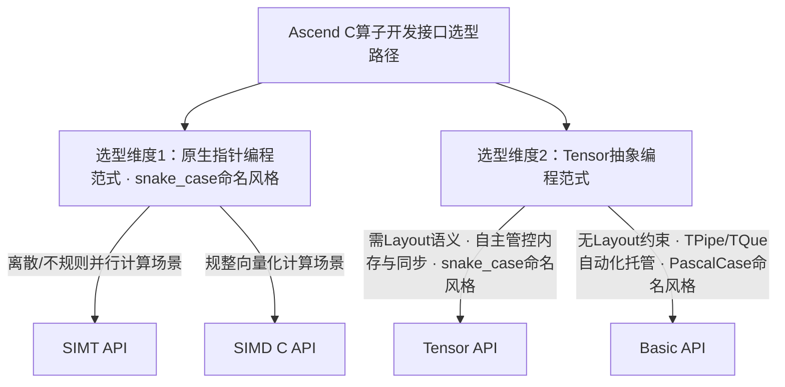

# Ascend C多层级编程接口选择参考

欢迎使用[Ascend C](https://asc.gitcode.com)进行昇腾AI处理器算子开发。Ascend C不仅致力于**开放芯片完备编程能力支撑实现极致性能**，同时通过多层级编程API设计，让您能够根据项目需求、团队技能与性能目标，灵活选择最合适的API，在开发效率与运行性能之间取得最佳平衡。

---

## 设计目标

Ascend C以「**兼容C/C++标准 · 释放极致算力**」为核心设计理念：在严格遵循C/C++语言规范的基础上做最小化语法扩展，让具备C/C++开发基础的开发者可低门槛平滑迁移至昇腾平台，自主释放芯片全部算力潜能。语言同时兼容指针式原生C开发范式与Tensor+Layout现代C++编程模式，在深度支撑算子定制优化的同时，实现与现有C/C++开发生态的无缝衔接，保障跨平台开发体验的一致性。

我们坚持两大核心设计原则：
- **没有银弹**：不同业务场景对性能、开发效率的诉求存在差异，不存在适配所有场景的最优单一接口，分层设计是兼顾效率与性能的核心路径；
- **渐进式成长**：入门开发者可从高层易用接口快速上手，完成算法验证与原型落地；资深开发者可向下深入底层接口，通过精细化调优充分释放硬件潜能。

## API层级

Ascend C以「兼容标准C/C++语法、最小化语法扩展」为核心设计原则，构建轻量化、高性能的算子编程底层基座，分层提供不同抽象等级的编程接口。

| API层级 | 语言范式 | 核心特性 | 目标用户 | 核心价值 |
|---------|----------|----------|----------|----------|
| **Basic API** | C++ | 基于SIMD编程模型，采用无Layout约束的Tensor抽象编程；依托TPipe/TQue框架实现内存调度与执行同步的统一托管 | 通用算子库开发者 | 通过框架自动化完成内存与同步管理，屏蔽底层硬件实现细节，有效降低开发复杂度，提升编程易用性与工程交付效率 |
| **Tensor API** | C++ | 基于SIMD编程模型，依托Layout代数体系提供携带**Layout**语义的Tensor抽象；采用**arch/atom/algorithm**三层解耦的API架构设计 | 高性能算子优化开发者 | 将张量与布局作为一等公民，内置Layout代数运算能力，实现零成本编译抽象；三层解耦设计达成关注点分离，天然具备跨架构可移植性 |
| **SIMD C API** | C | 基于SIMD编程模型与**原生指针**编程范式，提供完整C语言级底层可编程能力；支持数组下标式内存访问，内存生命周期与执行同步完全由开发者自主管控 | 极致性能调优开发者 | 完全契合原生C语言开发习惯，支持深度定制内存排布与同步策略；指令级透明映射实现零封装开销，全面开放底层硬件能力，支撑精细化性能调优与极致算力释放 |
| **SIMT API** | C | 基于业界通用SIMT编程模型，以单线程为基本编程单元，原生支持离散不规则并行计算逻辑 | 不规则场景高性能算子开发者 | 天然适配离散、不规则的并行计算场景，支持业界主流异构开发范式，有效降低跨技术栈迁移成本与学习门槛 |

在底层编程接口体系之上，Ascend C进一步提供算子模板库与高阶API组件，通过沉淀通用开发能力与工程最佳实践，持续降低算子开发门槛，加速算法原型验证与业务落地。

在底层编程接口之上，Ascend C还提供了算子模板库与高阶API组件，沉淀通用开发能力，进一步降低开发门槛，加速算法原型落地：

| 组件层级 | 目标用户 | 核心价值 |
|----------|----------|----------|
| **算子模板库（ATVC/ATVOSS/BLAZE等）** | 算法开发人员 | 提供覆盖Vector、Cube等计算范式的典型算子高性能模板实现，支持基于模板的定制化扩展，快速适配业务场景的高性能算力需求，同时沉淀端到端性能优化最佳实践 |
| **高阶API** | 算法开发人员 | 封装Softmax、Matmul等通用单核计算算法原语，屏蔽底层硬件实现细节，支撑开发者快速搭建算法逻辑，高效完成功能验证与方案原型落地，缩短从想法到可运行算子的周期 |

此外，联合生态正持续建设Kernel编程C++标准库**asc-stl**、设备侧线性代数库**asc-mathdx**等基础组件，不断丰富Ascend C算子编程生态。

---

## 如何快速选择对应层级API？

Ascend C构建了覆盖不同编程范式的分层接口体系，开发者可结合自身开发习惯与业务场景特征，沿以下路径完成接口选型：

---

也可结合核心业务诉求，依据以下关键维度进行快速决策：

| 选型维度 | 推荐接口层级 | 选型依据 |
|----------|--------------|----------|
| **离散/不规则矢量计算场景** | SIMT API | 充分释放SIMT架构对离散、不规则并行任务的硬件加速优势，同时兼容业界通用SIMT编程范式，降低开发者迁移学习成本 |
| **极致性能调优（指针开发习惯）** | SIMD C API | 支持标准C语言指针开发范式，支持内存排布、同步逻辑的全链路自主管控，可最大化挖掘芯片硬件算力，达成极致性能表现 |
| **C++ Tensor范式算子开发** | Tensor API | 原生支持带Layout语义的Tensor抽象，通过Layout代数能力简化内存布局管理与索引计算，兼顾开发便捷性与深度性能调优空间 |
| **算法原型快速验证** | 高阶API/算子模板库 | 内置通用单核算法与典型算子的高性能泛化实现，屏蔽底层硬件实现细节，大幅缩短开发周期，提升算法迭代与落地效率 |

---

## 层级详细介绍

### 语言扩展层SIMT API

**核心定义**

作为Ascend C语言扩展层的多线程并行编程接口，原生兼容业界主流SIMT编程模型，保障跨技术栈开发体验的一致性，支撑离散不规则计算场景的高性能算子开发。

**核心特性**

- **标准SIMT编程模型兼容**：支持业界通用的编程模型与接口，具备SIMT技术栈开发经验的工程师可快速适配，有效降低迁移学习成本，实现既有开发经验与工程资产的平滑复用。

**适用场景**

- 具备SIMT异构开发背景，需低成本、高效率迁移至昇腾AI处理器平台的开发人员；
- 离散寻址、不规则并行等非规整计算场景的算子开发与算法原型快速验证。

**参考示例**

- [SIMT Gather算子示例（标准编程范式）](../../examples/03_simt_api/00_introduction/01_gather/basic_gather/gather_1d/gather_1d.asc)
- 更多示例详见[examples目录](../../examples)

---
### 语言扩展层SIMD C API

**核心定义**

作为Ascend C语言扩展层的向量化编程接口，完全遵循标准C语言开发范式，提供指令级透明的底层可编程能力；支持内存排布与执行同步的全链路自主管控，以零封装开销释放硬件算力，支撑精细化性能调优与极致性能实现。

**核心特性**

- **原生C语言范式兼容**：支持标准C语言算子开发模式，原生支持数组式内存分配与指针式计算原语；全量接口统一采用`asc_xxx`前缀的snake_case命名规范，语义明确、辨识度高，降低开发者理解与接入成本。
- **体系化SIMD向量化接口**：提供覆盖全场景的连续矢量计算接口矩阵，满足绝大多数常规算子的开发需求。以基础矢量加法接口为例：`asc_add(__ubuf__ half* dst, __ubuf__ half* src0, __ubuf__ half* src1, uint32_t count)`，接口定义直观，调用逻辑简洁。
- **分级同步机制设计**：兼顾开发效率与性能可控性，提供分层同步能力。面向快速开发与功能验证场景，内置简化同步管理机制，配套提供`_sync`后缀的一体化计算接口（如`asc_add_sync(...)`），开发者无需显式管控同步时序，即可快速完成功能落地。
- **高级数据排布管控能力**：面向极致性能调优场景，提供携带`repeat`/`stride`等控制参数的高级计算接口，支持灵活配置数据访问步长、重复计算模式与内存排布策略，支撑开发者深度定制计算逻辑，充分挖掘硬件算力上限。

**适用场景**

- 具备扎实C语言开发基础、偏好原生指针编程范式的底层算子研发人员；
- 生产级高性能算子开发场景，需对硬件算力进行深度挖掘与极致性能调优的项目。

**参考示例**

- [SIMD Add算子示例（同步一体化计算接口）](../../examples/02_simd_c_api/00_introduction/01_add/c_api_sync_add/c_api_add.asc)
- 更多示例详见[examples目录](../../examples)

### Tensor API：带Layout语义的C++底层编程接口（全自主资源管控）

**核心定义**

面向高性能算子深度开发的C++级底层编程接口，以搭载Layout语义的Tensor为核心编程抽象，提供完整的底层硬件可编程能力；支持开发者全自主管控内存分配与执行同步，在支持业界Tensor编程范式的同时，实现硬件算力的深度释放。

**核心特性**

- **标准化Tensor抽象**：基于Tensor对象与数据类型体系完成NPU硬件指令的封装，支持业界通用的Tensor编程模型，保障跨平台开发体验的一致性。
- **全自主资源管控**：提供独立于TPipe/TQue框架的原生内存分配接口与同步原语，支持开发者基于Tensor对象自主管控内存生命周期与执行时序，满足深度性能调优的定制化需求。
- **Layout一等公民设计**：将数据布局（Layout）纳入Tensor原生属性体系，通过统一的布局抽象与代数运算能力，自动化简化内存索引推导与布局变换逻辑，显著降低复杂数据排布场景的开发复杂度，提升代码可维护性。
- **零成本编译抽象**：从arch到algorithm全层均为轻量编译封装；无虚函数、无动态内存分配，运行性能与手写C代码完全等价。
- **三层解耦，关注点分离**：硬件指令(arch)、原子层(atom)、算法层(algorithm)独立演化；新架构仅需新增arch层变化，atom与algorithm层代码几乎无需修改。
- **乐高式高度可组合**：任意atom可适配任意algorithm，任意layout可结合任意atom；通过模块化积木式拼接构建内核，大幅度降低kernel开发成本。
- **天然架构可移植性**：用户代码面向algorithm/atom接口编程，硬件差异由arch层代码特化屏蔽；良好支持跨架构、跨芯片代码迁移与复用。

**适用场景**

- 具备业界C++ Tensor开发经验，希望低门槛迁移至昇腾平台的算子开发者；
- 生产级高性能算子开发场景，在追求极致硬件性能的同时，需保障代码的规范性、可维护性与可扩展性。

**参考示例**

- [基于Tensor API的Matmul示例](../../examples/01_simd_cpp_api/03_basic_api/03_matrix_compute/mmad_tensor_api/mmad_tensor_api.asc)

### 基础API（Basic API）：轻量化Tensor编程接口（TPipe/TQue自动化资源管理）

**核心定义**

面向高效开发的轻量化C++编程接口，基于无Layout约束的Tensor抽象构建，依托TPipe/TQue框架实现内存调度与执行同步的全自动化托管，屏蔽底层硬件细节，大幅降低算子开发门槛，提升工程落地效率。

**核心特性**

- **轻量指令封装**：基于Tensor与数据类型对NPU基础计算指令进行抽象，提供简洁易用的Tensor编程接口，学习成本低，可快速上手开发。
- **框架级自动化管控**：内置TPipe/TQue编程框架，借鉴标准C++队列的设计思想，自动化完成内存分配、数据搬运与执行同步的全链路调度，开发者无需关注底层硬件实现细节。
- **渐进式能力演进**：当前以无Layout的Tensor编程为核心能力，后续将逐步引入Layout语义，迭代完善布局表达能力，在保持易用性优势的基础上扩展场景适配范围。

**适用场景**

- 算子开发入门者，或优先保障开发效率、无需深度定制硬件资源策略的开发场景；
- 常规性能需求的算子快速工程化落地，希望依托框架降低开发与维护成本的场景。

**参考示例**

- [基于Tque/Tpipe自动管理内存与同步的SIMD Add算子示例](../../examples/01_simd_cpp_api/00_introduction/01_add/add_tpipe_tque/add_tpipe_tque.asc)
- [基于LocalMemoryAllocator自主管理内存与同步的SIMD Add算子示例](../../examples/01_simd_cpp_api/00_introduction/01_add/add/add.asc)

### 高阶API：单核通用算法封装接口

**核心定义**

面向算法快速迭代的高层封装接口，对深度学习主流单核计算算法进行标准化抽象与性能优化，提供开箱即用的通用算法能力，在保障基础性能的前提下，最大化提升算法验证与原型开发效率。

**核心特性**

- **通用算法开箱即用**：内置Softmax、Matmul等主流单核计算算法的标准化实现，覆盖深度学习核心计算场景，通过高层API即可直接调用，无需从零搭建计算逻辑。
- **泛化场景性能保障**：针对典型网络与通用业务场景完成预优化，在常规配置下具备接近手工优化的性能表现，平衡开发效率与运行效率。
- **底层逻辑透明化**：完全屏蔽硬件指令、内存排布、同步调度等底层细节，开发者仅需关注算法逻辑本身，即可快速完成功能落地。

**适用场景**

- 算法原型快速验证、方案可行性调研阶段，对单算子极致性能无刚性要求的场景；
- 希望复用成熟算法实现，压缩算子开发周期、快速交付业务功能的工程场景。

**参考示例**

- [Softmax API示例](../../examples/01_simd_cpp_api/04_advanced_api/01_activation/softmax/softmax.asc)
- [Matmul API示例](../../examples/01_simd_cpp_api/04_advanced_api/00_matmul)

### 算子模板库：场景化高性能算子参考实现框架

**核心定义**

面向深度定制与极致性能优化的算子开发组件库，提供覆盖Vector、Cube等计算范式的典型算子端到端参考实现，以模板化设计支持灵活定制扩展，是特定场景下算子性能优化与工程落地的最佳实践载体。

**核心特性**

- **端到端最佳实践**：提供典型算子的完整工程化实现，包含Tiling策略设计、多级内存调度、计算逻辑优化的全链路方案，可直接作为高性能算子开发的参考基准。
- **场景化极致优化**：针对目标计算场景进行深度硬件适配与性能调优，优先保障特定场景下的峰值算力释放，为业务定制化开发提供性能基线与优化思路。
- **模板化灵活扩展**：采用泛型模板架构设计，支持开发者基于现有模板进行参数配置、逻辑修改与场景适配，快速孵化满足业务需求的定制化高性能算子。

**适用场景**

- 需要基于典型算子进行深度定制开发，快速适配特定业务场景高性能需求的开发场景；
- 学习昇腾算子性能优化方法论，开展极致性能调优的研发场景。

**参考示例**

- Vector类算子模板库：
  - [ATVC](https://gitcode.com/cann/atvc)：Ascend C矢量计算模板集合，为典型Vector算子提供标准化开发模板头文件
  - [ATVOSS](https://gitcode.com/cann/atvoss)：矢量算子子程序模板库，为昇腾硬件Vector类融合算子提供极简、高性能、高扩展的编程范式
- Cube类算子模板库：
  - [BLAZE](https://gitcode.com/cann/ops-tensor)：Ascend C算子模板库，聚焦提供高性能矩阵乘类算子基础模板与工程化最佳实践，支持矩阵乘及相关融合算子的定制化开发

## 总结

Ascend C多层级接口设计的核心理念是：让您**始终使用最合适的编程范式，而非被动适应单一抽象**。无论您是追求极致性能的底层专家，还是希望快速验证算法的原型开发者，都能在Ascend C的层级化API生态中找到得心应手的工具。

立即开始您的算子编程之旅！如有疑问，欢迎参考[Ascend C详细文档](https://asc.gitcode.com)或[社区示例](../../examples)，我们将持续致力于让NPU的强大算力对您触手可及、高效易用。
