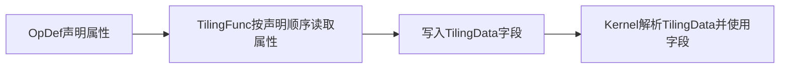

# 通过TilingData传递属性信息

本文属于扩展内容，介绍算子属性参与Kernel计算时所需的数据传递方法。算子属性在Host侧保存，Kernel不能直接读取。属性需要参与Kernel计算时，Host侧Tiling函数先读取属性值，再把Kernel真正需要的数据写入TilingData，由框架传到Kernel侧。

本文以LeakyReluCustom的`negative_slope`属性为例，介绍如何通过TilingData将属性从Host侧传递至Kernel侧，包括在算子原型中声明属性、在Host侧读取属性并写入TilingData，以及在Kernel侧从TilingData中读取并使用该属性。TilingData的基础定义和写入方法见[基本流程](./Host侧Tiling实现.md)。

## 属性传递流程

属性传递流程如下：



只有Kernel运行时需要使用的结果才写入TilingData。如果属性只影响Host侧的切分、Block数量或TilingKey，Host侧完成计算后传递最终运行参数即可，不需要原样传递属性。

## 在算子原型中声明属性

LeakyReluCustom的计算语义如下：

$$
y =
\begin{cases}
x, & x \ge 0 \\
\text{negative\_slope} \times x, & x < 0
\end{cases}
$$

在算子原型中将`negative_slope`声明为可选浮点属性，默认值为`0.0f`：

```cpp
this->Attr("negative_slope")
    .AttrType(OPTIONAL)
    .Float(0.0f);
```

`OPTIONAL`表示调用算子时可以不显式传入该属性；未传入时，使用`Float(0.0f)`设置的默认值。属性在原型中的声明位置和基础用法见[算子原型定义](./算子原型定义.md)；`AttrType`以及`Bool`、`Float`、`Int`等属性类型接口的参数和默认值约束见[OpAttrDef](../../../../../api/Utils-API/原型注册与管理/OpAttrDef/OpAttrDef-272.md)。

## 在TilingData中增加字段

使用标准C++语法定义TilingData时，直接增加与Kernel侧使用类型一致的字段：

```cpp
#ifndef LEAKY_RELU_CUSTOM_TILING_H
#define LEAKY_RELU_CUSTOM_TILING_H
#include <cstdint>

struct LeakyReluCustomTilingData {
    uint32_t totalLength;
    uint32_t tileNum;
    // 保存Host侧读取到的属性值，供Kernel计算使用。
    float negativeSlope;
};

#endif // LEAKY_RELU_CUSTOM_TILING_H
```

TilingData字段保存的是传给Kernel的数据，不要求与属性同名。建议使用能直接表达Kernel用途的名称，并选择大小固定、可直接复制的字段类型，例如整数、浮点数、布尔值或定长数组；不要使用指针、引用或动态容器。

## Host侧TilingFunc读取属性并写入TilingData

`context->GetAttrs()`返回本次调用的属性列表。`GetAttrPointer<T>(index)`通过属性在列表中的位置读取对应的值，`index`按照原型中`Attr`的声明顺序从0开始编号。本例只声明了`negative_slope`一个属性，因此将它的索引定义为0。

`negative_slope`的取值在不同调用之间可能变化，因此TilingFunc需要读取本次调用的属性值，不能在Tiling实现中将其写成固定常量。

```cpp
namespace optiling {
constexpr uint32_t NUM_BLOCKS = 8;
constexpr uint32_t TILE_NUM = 16;
// negative_slope是原型中声明的第一个属性，因此索引为0。
constexpr size_t NEGATIVE_SLOPE_INDEX = 0;

static ge::graphStatus TilingFunc(gert::TilingContext* context)
{
    LeakyReluCustomTilingData* tiling =
        context->GetTilingData<LeakyReluCustomTilingData>();
    uint32_t totalLength =
        context->GetInputShape(0)->GetOriginShape().GetShapeSize();

    // 按属性索引读取negative_slope；模板参数float需要与原型中的
    // Float属性类型保持一致。
    const gert::RuntimeAttrs* attrs = context->GetAttrs();
    const float* negativeSlope =
        attrs->GetAttrPointer<float>(NEGATIVE_SLOPE_INDEX);
    if (negativeSlope == nullptr) {
        return ge::GRAPH_FAILED;
    }

    context->SetSimdNumBlocks(NUM_BLOCKS);
    tiling->totalLength = totalLength;
    tiling->tileNum = TILE_NUM;
    // 将属性值写入TilingData，随其他运行参数一起传到Kernel侧。
    tiling->negativeSlope = *negativeSlope;

    size_t* currentWorkspace = context->GetWorkspaceSizes(1);
    currentWorkspace[0] = 0;
    return ge::GRAPH_SUCCESS;
}
} // namespace optiling
```

即使属性在原型中定义了默认值，读取后仍建议判空，避免索引、类型或工程版本不匹配时直接解引用无效指针。

### 属性类型对应关系

`GetAttrPointer<T>`的模板参数需要与原型声明的属性类型一致。

| 原型属性接口 | Host侧读取类型 | 适合写入TilingData的类型 |
|---|---|---|
| `.Bool(...)` | `bool` | `bool`或明确宽度的整数 |
| `.Float(...)` | `float` | `float` |
| `.Int(...)` | 与接口约定一致的整数类型 | 按Kernel需求检查范围后转换 |

属性读取类型不匹配会导致数据解析错误。整数属性转换成`uint32_t`等更窄类型前，需要检查负数和溢出范围。

### 多属性场景

假设原型按以下顺序声明两个属性：

```cpp
this->Attr("axis").AttrType(REQUIRED).Int();
this->Attr("keep_dims").AttrType(OPTIONAL).Bool(false);
```

Host侧对应使用索引0和1：

```cpp
const gert::RuntimeAttrs* attrs = context->GetAttrs();
const int64_t* axis = attrs->GetAttrPointer<int64_t>(0);
const bool* keepDims = attrs->GetAttrPointer<bool>(1);
if (axis == nullptr || keepDims == nullptr) {
    return ge::GRAPH_FAILED;
}
```

新增、删除或调整属性顺序时，需要同步检查所有`GetAttrPointer(index)`调用。建议为索引定义具名常量，避免在Tiling函数中散落数字。

## Kernel侧使用属性

Kernel入口解析TilingData后，将属性字段传给Kernel实现类：

```cpp
constexpr uint32_t STATIC_TILE_LENGTH = 64;

extern "C" __global__ __aicore__ void leaky_relu_custom(
    GM_ADDR x, GM_ADDR y,
    GM_ADDR workspace, GM_ADDR tiling)
{
    // 注册并解析默认TilingData，其中negativeSlope由Host侧写入。
    REGISTER_TILING_DEFAULT(LeakyReluCustomTilingData);
    GET_TILING_DATA(tilingData, tiling);

    KernelLeakyRelu<STATIC_TILE_LENGTH> op;
    // 将解析出的属性值传给Kernel实现类。
    op.Init(x, y, tilingData.totalLength, tilingData.tileNum,
            tilingData.negativeSlope);
    op.Process();
}
```

`Init`把`negativeSlope`保存为Kernel类成员。配套样例使用`Maxs`、`Mins`、`Muls`和`Add`组合实现LeakyRelu：

```cpp
float inputVal = 0.0f;

// 分别取输入的非负部分和负数部分。
AscendC::Maxs(tmpTensor1, xLocal, inputVal, tileLength);
AscendC::Mins(tmpTensor2, xLocal, inputVal, tileLength);
// 负数部分乘以negativeSlope，再与非负部分相加。
AscendC::Muls(
    tmpTensor2, tmpTensor2, this->negativeSlope, tileLength);
AscendC::Add(yLocal, tmpTensor1, tmpTensor2, tileLength);
```

上述计算等价于：

```text
tmpTensor1 = max(x, 0)
tmpTensor2 = min(x, 0) * negativeSlope
y = tmpTensor1 + tmpTensor2
```

计算完成后再按Kernel基本流程把`yLocal`写回Global Memory。示例中的属性值只在`Init`时读取一次，不在Tile循环中重复解析TilingData。

如果某个属性只用于Host侧选择TilingKey，例如根据`algorithm`属性选择不同Kernel分支，则可以直接调用`context->SetTilingKey(...)`，不再额外增加TilingData字段。分支组织方法见[多分支策略](./多分支策略.md)。

## 相关文档

- [算子原型定义](./算子原型定义.md)：声明属性及默认值。
- [Host侧Tiling实现](./Host侧Tiling实现.md)：定义和写入TilingData。
- [Kernel侧算子实现](./Kernel侧算子实现.md)：注册、解析并使用TilingData。
- [多分支策略](./多分支策略.md)：使用属性选择TilingKey或Kernel模板分支。
